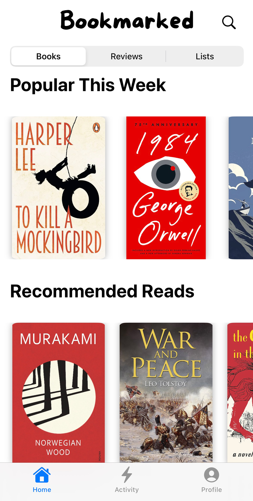
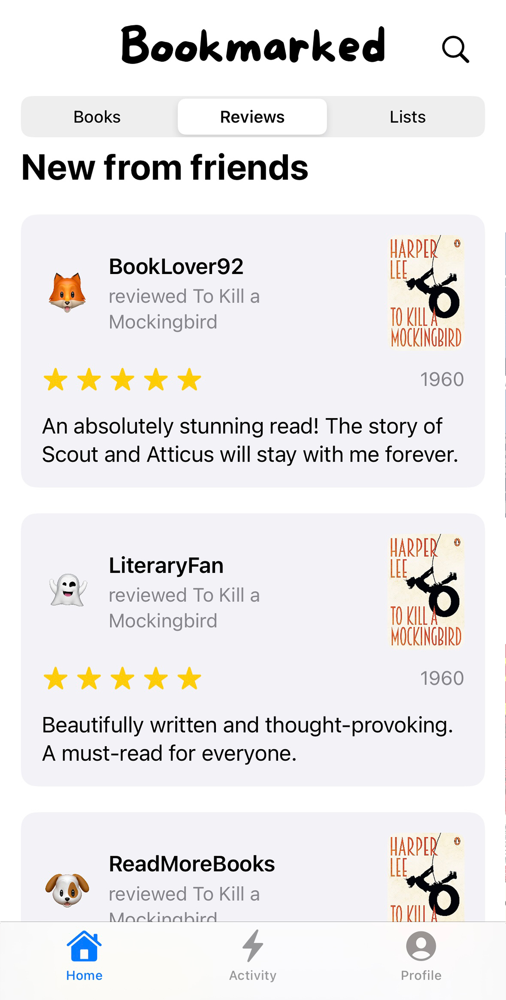
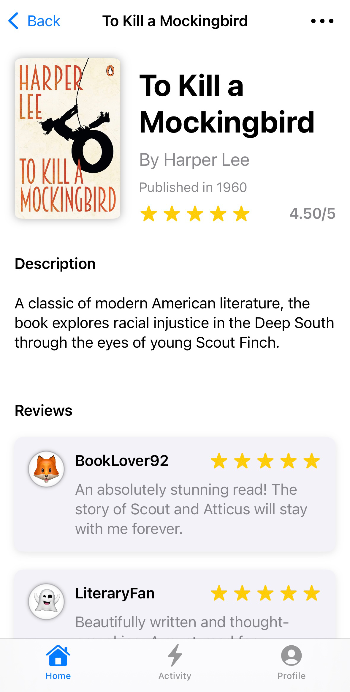

<p align="center">
     <!-- Optional logo image, you can remove or replace this line -->
</p>

<h1 align="center">Bookmarked 📚</h1>

<p align="center">
  A beautifully designed iOS app for book lovers to track their reads, write reviews, and create custom book lists. <br>
  Built using SwiftUI for a <b>seamless, modern experience</b>.
</p>

## Features  

- 📖 **Explore Popular Books**  
  Discover trending books and curated recommendations.  

- ✍️ **Write and Browse Reviews**  
  Share your thoughts on books and see reviews from others, complete with ratings and avatars.  

- 🗂️ **Organize Custom Lists**  
  Create personalized lists to keep track of your favorite reads.  

- 🔍 **Search with Ease**  
  Quickly find books, authors, and reviews with an intuitive search interface.  

## Screenshots  

<div style="display: flex; justify-content: space-between;">
    &nbsp
   &nbsp
  
</div>

## Requirements  

- iOS 15 or later  
- Xcode 15 or later  

## Installation

1. Clone the repository:  
   ```bash
   git clone https://github.com/dsaldamarco/Bookmarked.git
2. Open the project in Xcode.
3. Run the app on a simulator or connected device.


 ## Built With  

- **SwiftUI**  
  For crafting beautiful, declarative user interfaces.  

- **Xcode**  
  The primary IDE used for development and debugging.  

- **Core Data**  
  To handle offline storage and persistence.  

- **UIKit (partially)**  
  Leveraged for some components to extend functionality.

## Author
Created by <b>Dario Saldamarco.</b> <br>
Feel free to reach out for feedback or collaboration!

## 📄 License
This project is licensed under the MIT License. See the [LICENSE](LICENSE) file for details.
   
